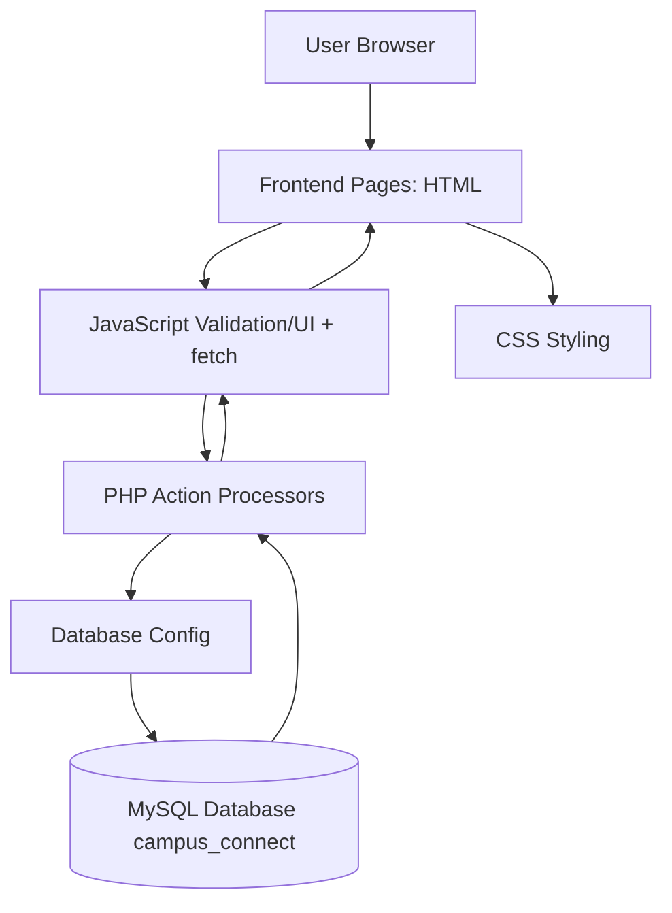
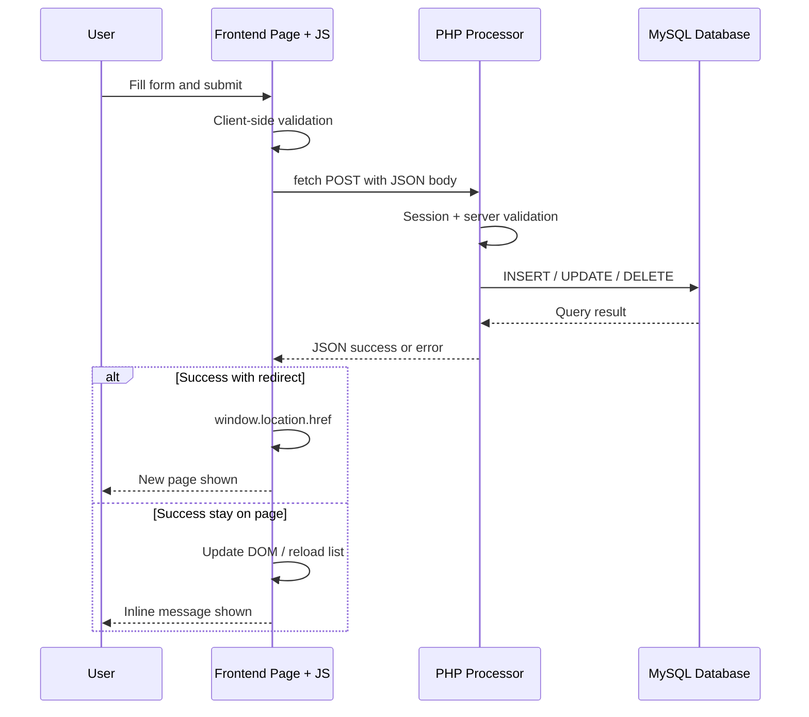
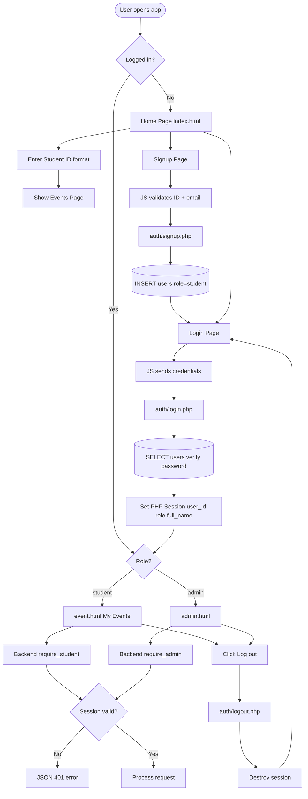
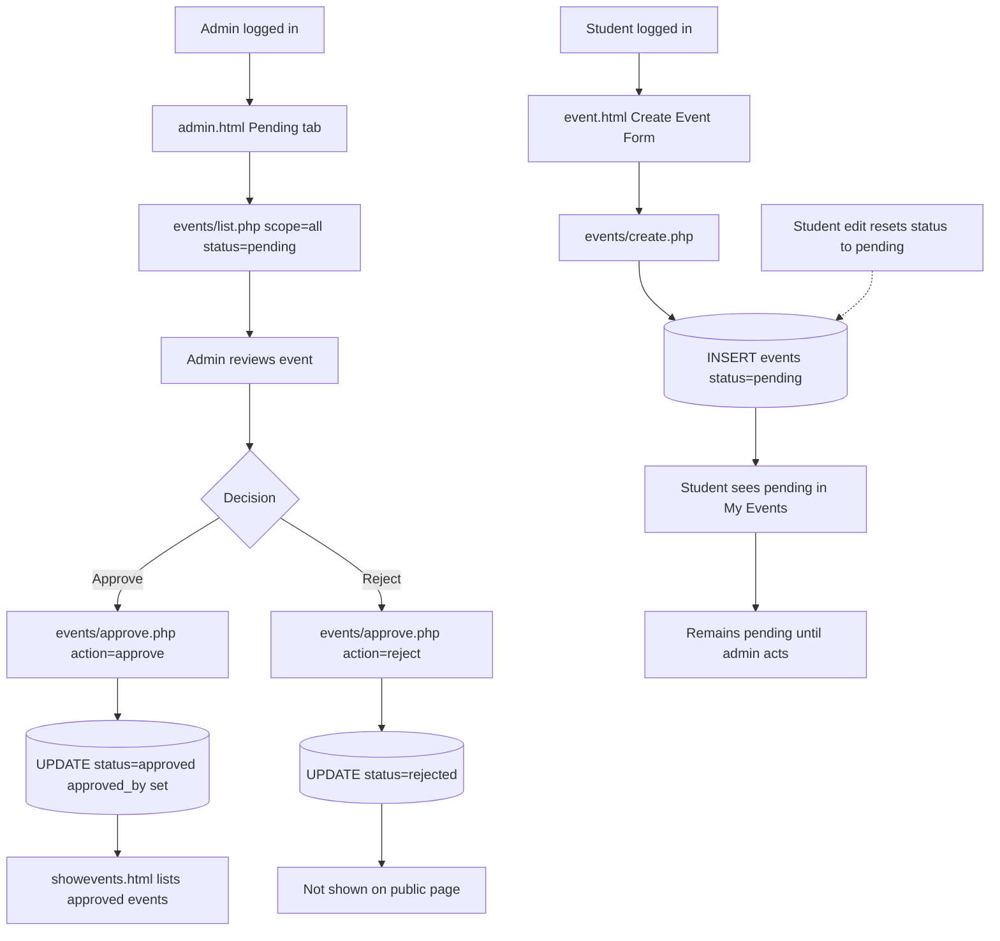
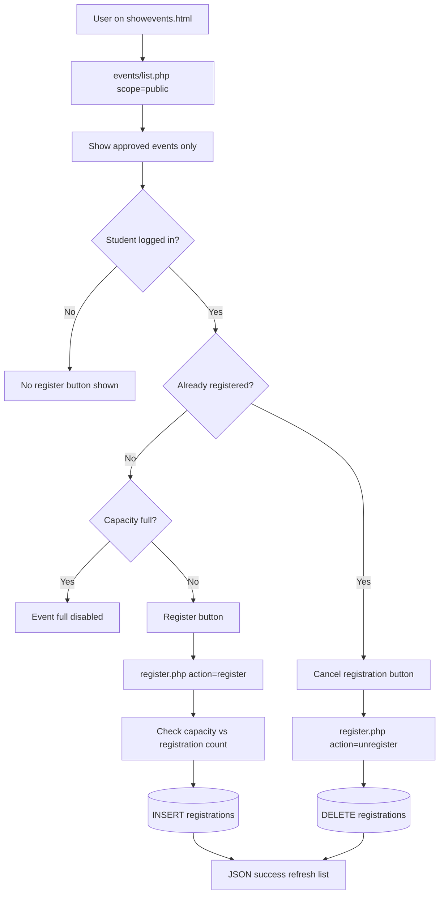

# UniEvent — Architecture

**Repository:** Campus Connect (`Web-and-Internet-Technology`)  
**Architecture type:** Simple PHP + MySQL multi-page web application

---

## 1. Architecture Style

UniEvent uses a **classic multi-page web application** architecture:

- **Frontend:** Separate HTML pages in `frontend/html/`
- **Backend:** One PHP file per action in `backend/`
- **Database:** MySQL via MySQLi
- **State:** PHP sessions (`$_SESSION`) with cookie

There is **no framework**, **no microservices**, and **no separate REST API product**. However, the frontend communicates with PHP using **JavaScript `fetch()`** and **JSON responses** rather than full-page HTML form POST with `header("Location: ...")` redirects.

---

## 2. Layer Explanation

| Layer | Location | Responsibility |
|-------|----------|----------------|
| **Frontend Pages** | `frontend/html/*.html` | Pages shown to the user; forms and layout |
| **Styling Layer** | `frontend/css/*.css` | Visual design, responsive layout |
| **Client-side Behavior** | `frontend/js/*.js` | Validation, dynamic lists, `fetch()` to backend |
| **Backend Processing Layer** | `backend/**/*.php` | Auth, validation, MySQL operations, JSON output |
| **Database Layer** | MySQL `campus_connect` | Persistent data |
| **Configuration Layer** | `backend/config.php` | DB host, name, user, password; connection helper |

Shared bootstrap: `backend/session.php` (sessions, JSON headers, auth guards, input helpers).

---

## 3. Request Flow

### Actual flow in this repository

```
Browser (HTML page + JavaScript)
    → User submits form (JS preventDefault)
    → fetch() POST/GET to backend/*.php
    → PHP validates session + input
    → MySQL query (prepared statements)
    → PHP returns JSON { success, message, data }
    → JavaScript updates DOM or window.location redirect
    → Browser shows result
```

### Course-style equivalent (conceptual)

```
Browser → HTML Form → POST → PHP Processor → MySQL → Redirect → Browser
```

This project achieves the same **server-side processing** and **database persistence**, but uses **AJAX-style fetch** for smoother UX instead of full page reloads on every action.

---

## 4. Folder Structure

```
Web-and-Internet-Technology/
├── database/
│   └── schema.sql
├── backend/
│   ├── config.php
│   ├── session.php
│   ├── auth/
│   │   ├── signup.php
│   │   ├── login.php
│   │   ├── logout.php
│   │   └── check_session.php
│   ├── events/
│   │   ├── list.php
│   │   ├── get.php
│   │   ├── create.php
│   │   ├── update.php
│   │   ├── delete.php
│   │   ├── approve.php
│   │   └── register.php
│   ├── users/
│   │   ├── list.php
│   │   └── delete.php
│   └── announcements/
│       ├── list.php
│       └── create.php
├── frontend/
│   ├── css/
│   │   ├── theme.css
│   │   ├── index.css
│   │   ├── login.css
│   │   ├── signup.css
│   │   ├── event.css
│   │   ├── showevents.css
│   │   └── admin.css
│   ├── html/
│   │   ├── index.html
│   │   ├── login.html
│   │   ├── signup.html
│   │   ├── showevents.html
│   │   ├── event.html
│   │   └── admin.html
│   ├── js/
│   │   ├── api.js
│   │   ├── index.js
│   │   ├── login.js
│   │   ├── signup.js
│   │   ├── event.js
│   │   ├── showevents.js
│   │   └── admin.js
│   └── images/
│       ├── signup-hero.svg
│       ├── event-management.svg
│       ├── admin-dashboard.svg
│       └── empty-state.svg
├── docs/
├── README.md
└── DOCUMENTATION.md
```

---

## 5. Key File Responsibilities

| File Path | Responsibility | Related Feature |
|-----------|----------------|-----------------|
| `backend/config.php` | MySQL connection (`get_db_connection`) | All DB access |
| `backend/session.php` | Session start, JSON helpers, role guards, validators | Auth + all endpoints |
| `backend/auth/signup.php` | Register student in `users` | Signup |
| `backend/auth/login.php` | Verify password, set session | Login |
| `backend/auth/logout.php` | Destroy session | Logout |
| `backend/auth/check_session.php` | Return current user JSON | Nav bar / page guards |
| `backend/events/list.php` | List events by scope (public/mine/all) | Event listing |
| `backend/events/create.php` | Insert pending event (student only) | Event submission |
| `backend/events/update.php` | Update event (owner or admin) | Edit event |
| `backend/events/delete.php` | Delete event (owner or admin) | Delete event |
| `backend/events/approve.php` | Approve/reject (admin) | Admin approval |
| `backend/events/register.php` | Register/unregister student | Event registration |
| `backend/events/get.php` | Single event details | Admin edit helper |
| `backend/users/list.php` | List students (admin) | Student management |
| `backend/users/delete.php` | Delete student (admin) | Student management |
| `backend/announcements/list.php` | List announcements | Admin announcements |
| `backend/announcements/create.php` | Post announcement | Admin announcements |
| `frontend/js/api.js` | Shared fetch wrapper, nav, logout | All JS pages |
| `frontend/html/index.html` | Guest entry gate | Home |
| `frontend/html/showevents.html` | Public approved events | Event browse |
| `frontend/html/event.html` | Student create/list events | My Events |
| `frontend/html/admin.html` | Admin dashboard | Admin |
| `database/schema.sql` | Schema + admin seed | Database setup |

---

## 6. Architecture Diagram



---

## 7. Form Submission Flow Diagram



---

## 8. Authentication Flow Diagram



---

## 9. Event Approval Flow Diagram

**Status: Implemented**



---

## 10. Event Registration Flow Diagram

**Status: Implemented**



---

## Design Notes for Presenters

- **`backend/`** is the equivalent of an `actions/` folder — each file handles one server action.
- **Sessions** tie the browser to the logged-in user across fetch requests (`credentials: 'include'`).
- **Foreign keys** in MySQL enforce referential integrity (delete user → cascade events/registrations).
