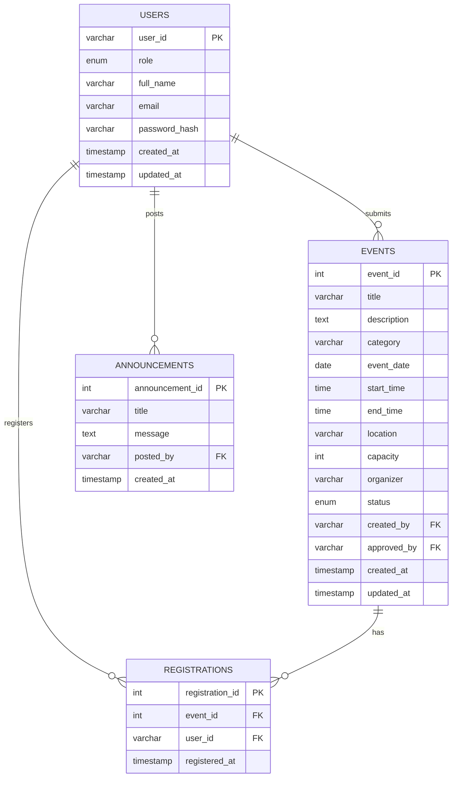

# UniEvent — Database Design

**Database name:** `campus_connect`  
**Schema file:** `database/schema.sql`  
**Engine:** InnoDB with foreign keys

---

## Overview

The database stores users (students and admins), events with approval status, student event registrations, and admin announcements. All persistent application data flows through these four tables.

---

## Import Instructions

1. Start MySQL in XAMPP.
2. Open phpMyAdmin: `http://localhost/phpmyadmin`
3. **Import** → select `database/schema.sql` → **Go**
4. Verify database `campus_connect` appears with 4 tables.
5. Confirm seed admin: `SELECT * FROM users WHERE user_id = 'Admin/001';`

**Connection settings** (`backend/config.php`):

| Setting | Default |
|---------|---------|
| Host | `localhost` |
| Database | `campus_connect` |
| User | `root` |
| Password | *(empty)* |

---

## Entity Relationship Diagram



All relationships above use **physical foreign keys** defined in `schema.sql`.

---

## Table: `users`

**Purpose:** Stores both student and admin accounts in one table, distinguished by `role`.

| Column | Data Type | Key / Constraint | Explanation |
|--------|-----------|------------------|-------------|
| `user_id` | VARCHAR(50) | PRIMARY KEY | Student ID (e.g. `EC/2022/049`) or admin ID (e.g. `Admin/001`) |
| `role` | ENUM('student','admin') | NOT NULL, default `student` | Determines permissions |
| `full_name` | VARCHAR(100) | NOT NULL | Display name |
| `email` | VARCHAR(150) | NULL | University email for students; admin email optional |
| `password_hash` | VARCHAR(255) | NOT NULL | bcrypt hash from PHP `password_hash()` |
| `created_at` | TIMESTAMP | DEFAULT CURRENT_TIMESTAMP | Account creation time |
| `updated_at` | TIMESTAMP | ON UPDATE CURRENT_TIMESTAMP | Last modification time |

**Sample data (seeded):**

| user_id | role | full_name | email |
|---------|------|-----------|-------|
| Admin/001 | admin | System Administrator | admin@campus.local |

Password for seed admin: **`Admin@123`** (hashed in SQL file).

---

## Table: `events`

**Purpose:** Campus events with admin approval workflow.

| Column | Data Type | Key / Constraint | Explanation |
|--------|-----------|------------------|-------------|
| `event_id` | INT | PRIMARY KEY, AUTO_INCREMENT | Unique event identifier |
| `title` | VARCHAR(150) | NOT NULL | Event name |
| `description` | TEXT | NULL | Longer details |
| `category` | VARCHAR(50) | NOT NULL, default `Workshop` | Workshop, Seminar, Social, etc. |
| `event_date` | DATE | NOT NULL | Event date |
| `start_time` | TIME | NOT NULL | Start time |
| `end_time` | TIME | NULL | Optional end time |
| `location` | VARCHAR(150) | NOT NULL | Venue |
| `capacity` | INT | NULL | Max attendees; NULL = unlimited |
| `organizer` | VARCHAR(150) | NULL | Club or organizer name |
| `status` | ENUM('pending','approved','rejected') | NOT NULL, default `pending` | Approval state |
| `created_by` | VARCHAR(50) | NOT NULL, FK → `users.user_id` | Submitting student |
| `approved_by` | VARCHAR(50) | NULL, FK → `users.user_id` | Admin who approved/rejected |
| `created_at` | TIMESTAMP | DEFAULT CURRENT_TIMESTAMP | Submission time |
| `updated_at` | TIMESTAMP | ON UPDATE CURRENT_TIMESTAMP | Last edit time |

**Status meanings:**
- `pending` — awaiting admin review (also after student edit)
- `approved` — visible on public events page
- `rejected` — hidden from public; visible to creator/admin

**Foreign keys:**
- `fk_events_creator`: `created_by` → `users.user_id` ON DELETE CASCADE
- `fk_events_approver`: `approved_by` → `users.user_id` ON DELETE SET NULL

---

## Table: `registrations`

**Purpose:** Links students to events they signed up for.

| Column | Data Type | Key / Constraint | Explanation |
|--------|-----------|------------------|-------------|
| `registration_id` | INT | PRIMARY KEY, AUTO_INCREMENT | Unique registration ID |
| `event_id` | INT | NOT NULL, FK → `events.event_id` | Which event |
| `user_id` | VARCHAR(50) | NOT NULL, FK → `users.user_id` | Which student |
| `registered_at` | TIMESTAMP | DEFAULT CURRENT_TIMESTAMP | When registered |

**Constraints:**
- `UNIQUE KEY uniq_registration (event_id, user_id)` — one registration per student per event
- `fk_reg_event`: ON DELETE CASCADE
- `fk_reg_user`: ON DELETE CASCADE

---

## Table: `announcements`

**Purpose:** Admin-posted notices (stored for admin panel display).

| Column | Data Type | Key / Constraint | Explanation |
|--------|-----------|------------------|-------------|
| `announcement_id` | INT | PRIMARY KEY, AUTO_INCREMENT | Unique ID |
| `title` | VARCHAR(150) | NOT NULL | Announcement headline |
| `message` | TEXT | NOT NULL | Body text |
| `posted_by` | VARCHAR(50) | NOT NULL, FK → `users.user_id` | Admin author |
| `created_at` | TIMESTAMP | DEFAULT CURRENT_TIMESTAMP | Post time |

**Foreign key:** `fk_announce_user` ON DELETE CASCADE

**Note:** No public-facing page reads this table yet — **Partially Implemented** in the UI.

---

## Relationships Summary

| From | To | Type | FK Column | On Delete |
|------|-----|------|-----------|-----------|
| `events` | `users` | Many-to-one (creator) | `created_by` | CASCADE |
| `events` | `users` | Many-to-one (approver) | `approved_by` | SET NULL |
| `registrations` | `events` | Many-to-one | `event_id` | CASCADE |
| `registrations` | `users` | Many-to-one | `user_id` | CASCADE |
| `announcements` | `users` | Many-to-one | `posted_by` | CASCADE |

---

## Common Queries Used in PHP

| Operation | File | SQL Pattern |
|-----------|------|-------------|
| Login | `auth/login.php` | `SELECT ... FROM users WHERE user_id = ?` |
| Signup | `auth/signup.php` | `INSERT INTO users ...` |
| Public events | `events/list.php` | `WHERE e.status = 'approved'` |
| My events | `events/list.php` | `WHERE e.created_by = ?` |
| Create event | `events/create.php` | `INSERT INTO events ... status pending` |
| Approve | `events/approve.php` | `UPDATE events SET status = ?, approved_by = ?` |
| Register | `events/register.php` | `INSERT INTO registrations` |
| Cancel reg | `events/register.php` | `DELETE FROM registrations WHERE ...` |
| List students | `users/list.php` | `WHERE role = 'student'` |

All use **prepared statements** via MySQLi.

---

## Sample Data for Demo (Optional Manual INSERT)

After signup, student data is created automatically. For a quick test event (admin would still need to approve if created_by is student):

Students are created through the signup form — no seed student in `schema.sql`.

To verify registration count:
```sql
SELECT e.title, COUNT(r.registration_id) AS registrations
FROM events e
LEFT JOIN registrations r ON r.event_id = e.event_id
GROUP BY e.event_id;
```

---

## Schema vs Legacy Documentation

The old `DOCUMENTATION.md` listed `email` as UNIQUE — the actual `schema.sql` does **not** enforce UNIQUE on email (duplicate check is done in PHP signup only). Document reflects **schema.sql** as source of truth.
