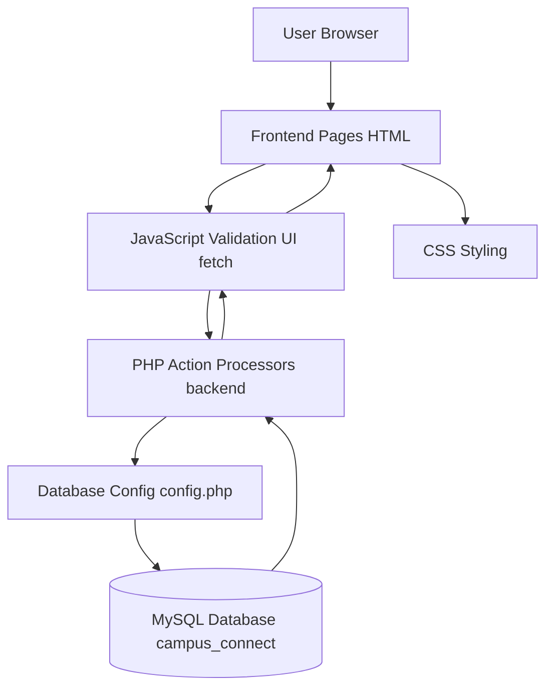
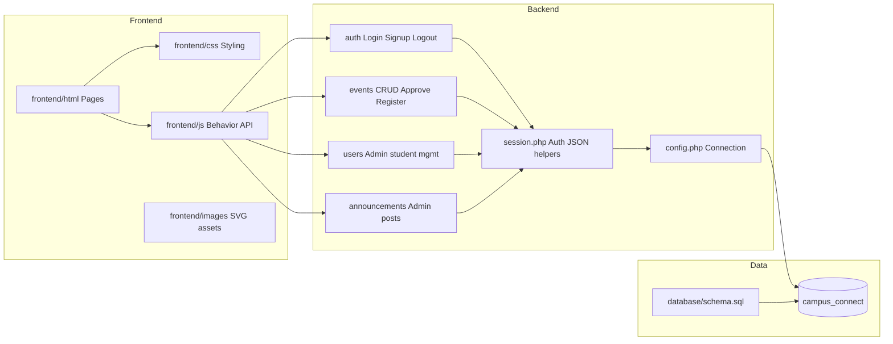
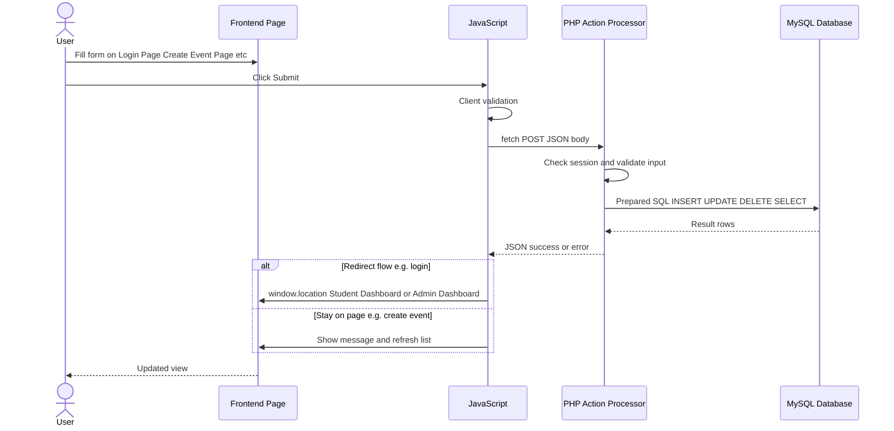
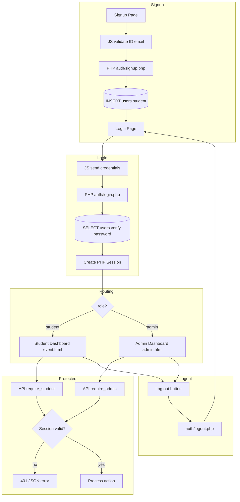
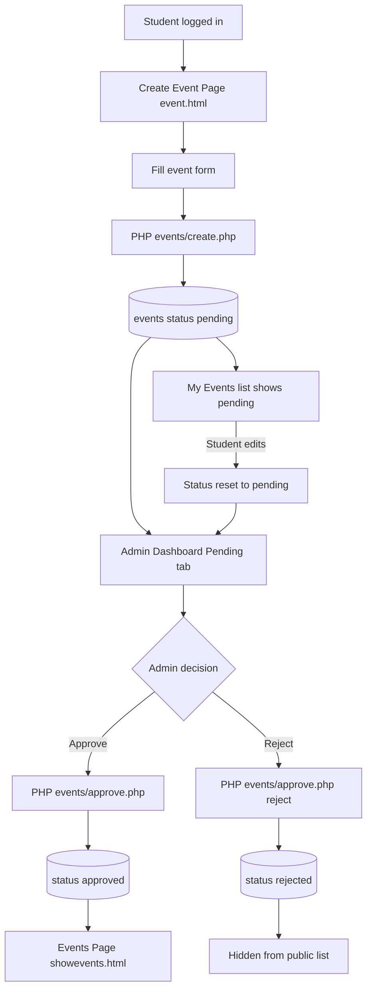
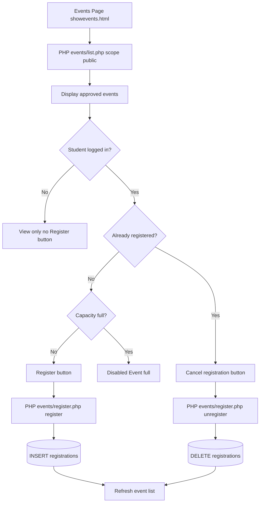
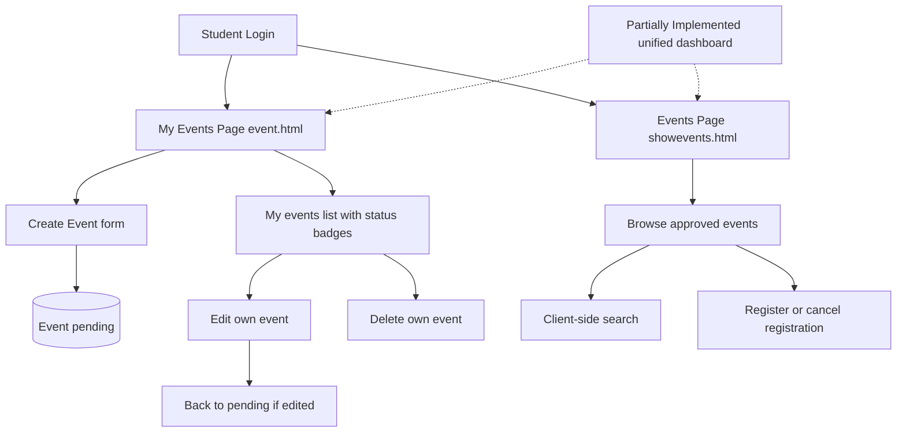
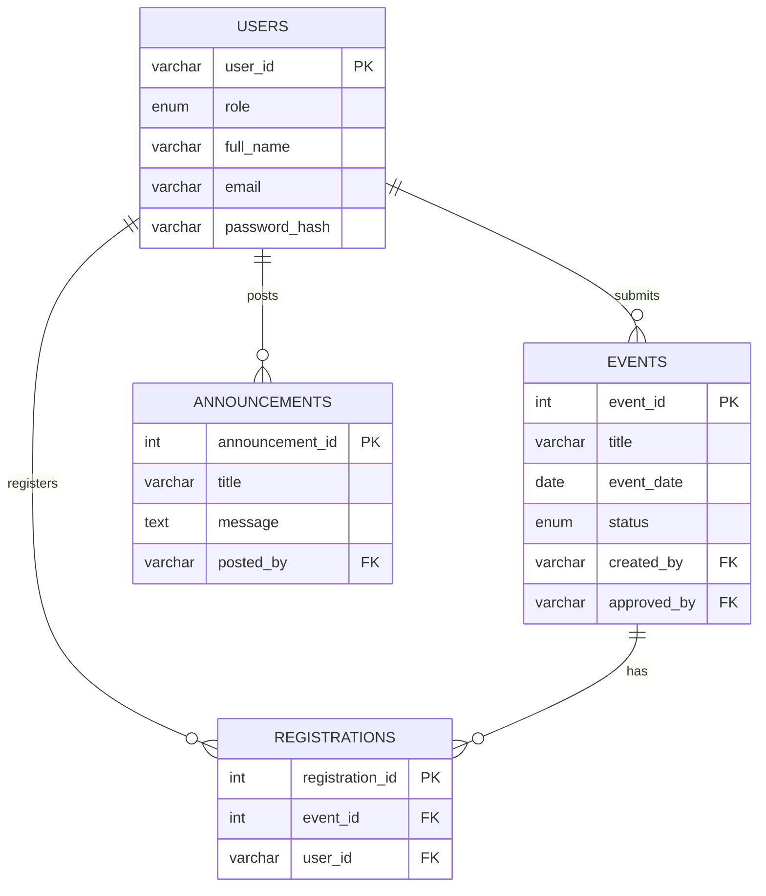
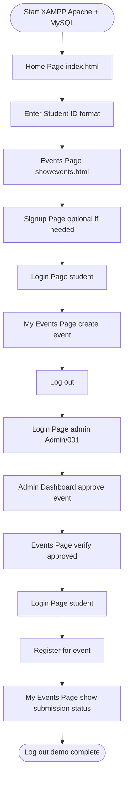

# UniEvent — Diagrams

All diagrams use **Mermaid** syntax. Render in GitHub, VS Code Mermaid preview, or [mermaid.live](https://mermaid.live).

**Project path:** Campus Connect / UniEvent — `Web-and-Internet-Technology`

---

## 1. System Architecture Diagram

**Explanation:** Shows how the browser, frontend layers, PHP processors, config, and MySQL connect. JavaScript fetch sits between pages and PHP.

---

## 2. Folder Responsibility Diagram

**Explanation:** Maps major folders to their role in the system.

---

## 3. Form Processing Flow Diagram

**Explanation:** Sequence from form submit through PHP validation, MySQL, JSON response, and UI update.

---

## 4. Authentication Flow Diagram

**Explanation:** Signup, login, session creation, protected access, and logout.

---

## 5. Event Submission and Approval Flow Diagram

**Explanation:** Student submits pending event; admin approves or rejects; approved events go public.

---

## 6. Event Registration Flow Diagram

**Explanation:** Student registers for an approved event on the Events Page; capacity and duplicate checks run server-side.

---

## 7. Student Dashboard Flow Diagram

**Explanation:** Student dashboard is split across My Events page (submissions) and Events Page (browse + register). No single combined page.

---

## 8. Database ER Diagram

**Explanation:** Four tables with physical foreign keys as defined in schema.sql.

---

## 9. Presentation Demo Flow Diagram

**Explanation:** Step-by-step path for tomorrow's live demonstration.

---

## Page Name Reference

| Label in Diagrams | File |
|-------------------|------|
| Home Page | `frontend/html/index.html` |
| Login Page | `frontend/html/login.html` |
| Signup Page | `frontend/html/signup.html` |
| Events Page | `frontend/html/showevents.html` |
| Create Event Page / My Events Page | `frontend/html/event.html` |
| Admin Dashboard | `frontend/html/admin.html` |
| PHP Action Processor | Files under `backend/` |
| MySQL Database | `campus_connect` |
